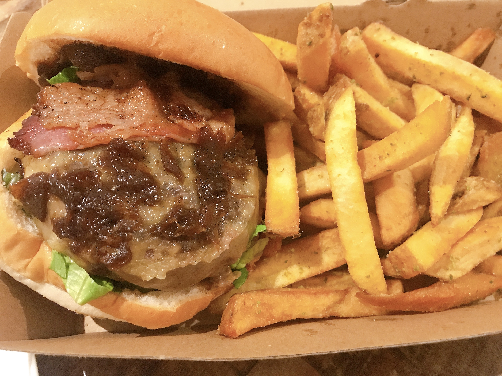

---
title: 【ロンドンのおしゃれハンバーガー】HONESTBURGER
date: 2020-10-03T23:00:00.000Z
description: ロンドンにいるなら１度は食べておきたいHONESTBURGERにいってきました。
slug: honest_burger
tags: 
  - イギリス生活
  - ロンドン
  - ハンバーガー
  - グルメ
  - レストラン
keywords: BURGER
---   

ロンドンには少し高いハンバーガー屋さんのチェーン店がいくつかあります。  
日本でおなじみのShake Shackはもちろん、FIVEGAYSという比較的安いハンバーガー屋さんなど、、、  
そのなかでも私がおすすめなのがHONESTBURGERです。  
外観はスタバのようなモスグリーンでお洒落な感じです。 
値段は大量のポテトがセットで£10〜£15くらいです。
今回はチーズバーガーを頼みました。  
  

チーズはチェダーと何か（忘れました）選べました。  
かなりボリュームがあります。  
中はこんな感じ。（違う日にテイクアウトしたのでその写真です。この日はベーコントッピング）  

なんといっても、この茶色のオニオンキャラメリゼが美味しい。  
甘くてほろ苦くて、日本では出会ったことのないハンバーガーソースです。  
パティと食べるとすこし甘じょっぱい、たまに食べたくなります。  
  
男性でもポテトまで食べ切るのは大変なくらいボリューミーなので、是非お腹が空いた時にいってみてください。  
