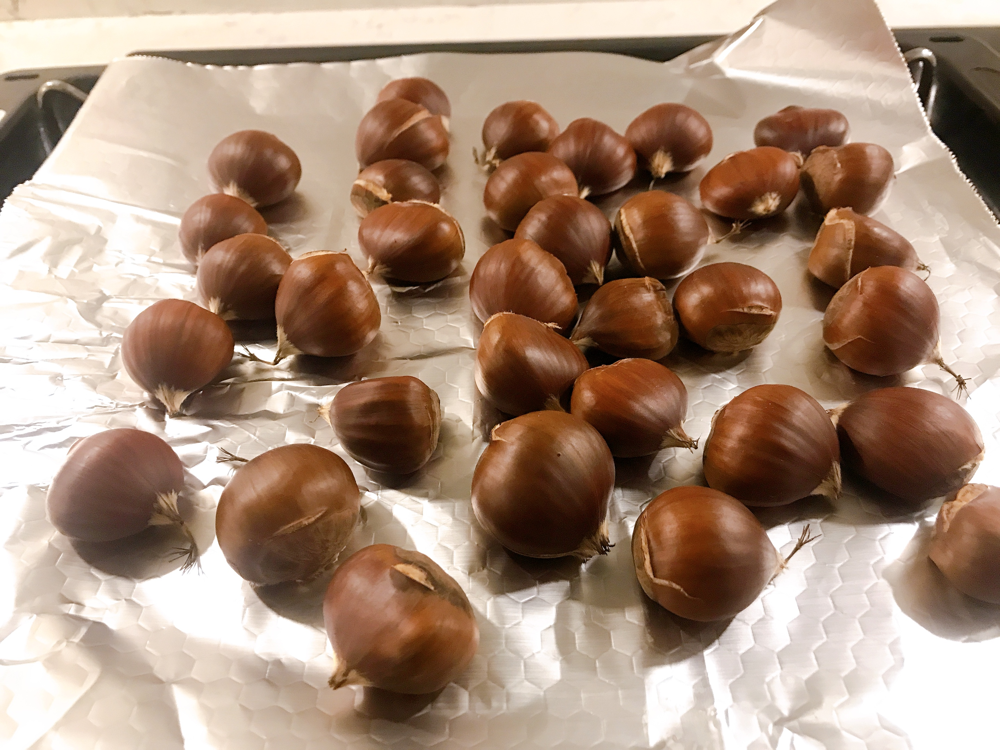
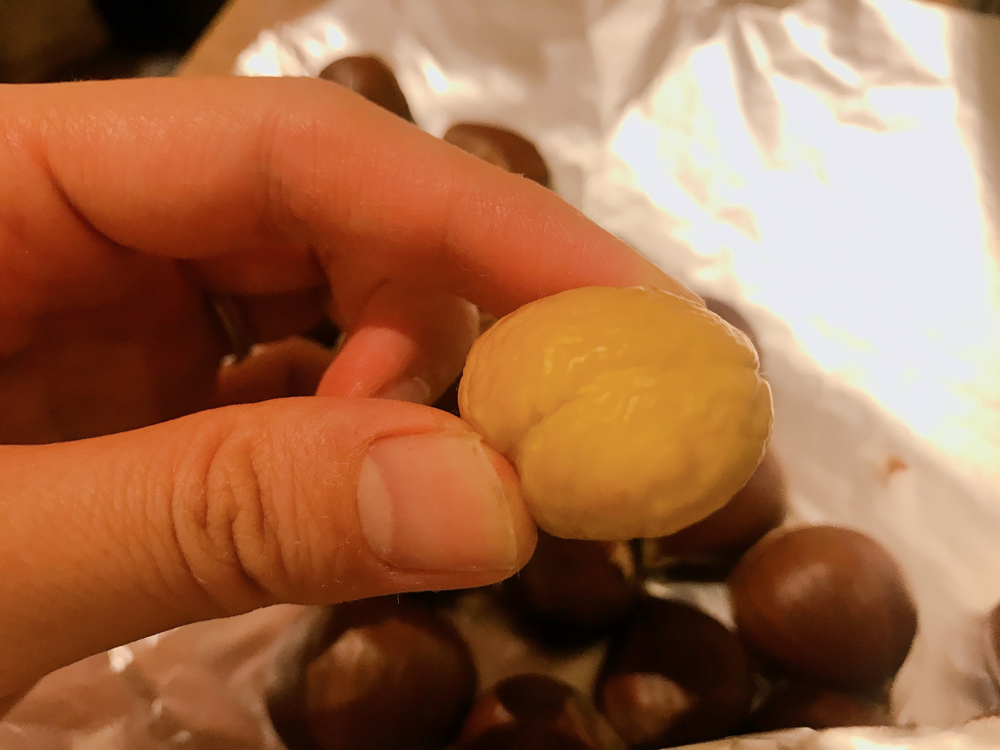

---
title: 【イギリス・ロンドンで栗】焼き栗
date: 2020-10-16T22:00:00.000Z
description: 秋なので栗を食べてみました。
slug: chest_nuts1
tags: 
  - イギリス生活
  - ロンドン
  - 栗
  - グルメ
keywords: chest_nuts1
---   

秋と言ったら、さんま、栗、サツマイモ、ぶどう、、、など食べたいものたくさん。
  
なかでも、栗は実家では拾ってきて茹でて食べていました。なつかしいー  
甘栗なんかも大好きです。  
ロンドンでも栗があると聞きつけ、スーパーで探してみることに。  
  
このくらいの量で£3.5くらい。日本に比べてこぶりです。どこのスーパーにもあります。  
商品名はマロンだと思ってたけどチェストナッツといいます。←私的には大発見。    

こちらのスタンダートな食べ方は焼き栗だと聞き、剥きやすいように熱湯につけお湯が冷めた後、ハゼないようにお尻に前後２箇所切り込みを入れてオーブンで焼きました。  
多分180度で15〜20分くらい、、、    
焼き終わったあとなるべく早くむくと、、

    
こんな感じで綺麗にむけました。  
味は、あんまり甘くない。素朴な感じ。そして渋皮が張り付いて剥きづらいのもあり、ぼろぼろになったものを少しずつ食べました。  

なので、あと１袋は渋皮煮に挑戦することに。  
挑戦レポートは次の記事で書きます。