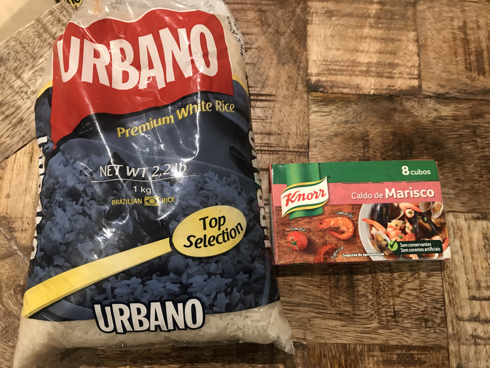

---
title: イギリスでタコのリゾットを作る
date: 2020-10-01T23:00:00.000Z
description: ポルトガルの名物料理アローシェ（タコのリゾット）を作りました。
slug: octopasu_risotto
tags: 
  - イギリス生活
  - ロンドン
  - ポルトガル
  - 料理
keywords: rizotto
---   

ヨーロッパで食べたものの中で一番美味しかったものといえば、ポルトガルの**タコのリゾット**です。   
ポルトガルは甘いポートワインとタコとイワシが名物で、旅行の間は毎日食べていました。  
そこで出会ったある店のタコのリゾットが美味しすぎて、、、    
美味しかったお店はまた何かの機会にレポートします。  

今回は、タコのリゾットをロンドンでも食べたい！でも、イギリス（たぶんイギリス全体）ではタコは高くて（£30/kgくらい）、たまーに買うくらい。（小さいタコは大きいものよりは安いです）  
そんな中、ロンドンにあるポルトガルレストランに併設しているポルトガル食材店で、半額くらいの値段で冷凍タコを売っているのを発見！！  
それっぽいスープストックもあったのでアローシェを作ってみました。  

**材料（3人分くらい）**  
タコ　250g  
ポルトガルライス（タイ米みたいなやつ）　1合 
クノール　Marisco スープストック　1個  
タコの茹で汁　　600cc      
玉ねぎ　大1個  
ローリエ　2枚  
塩、黒胡椒
イタリアンパセリ　適量　　　  
オリーブオイル　適量  
トマト（あれば）　1個  
下の写真がお米とスープストックです。  
  

**作り方**  
1.タコをぶつ切りにして茹でる。茹で汁は使うのでとっておく。  
2.玉ねぎをみじん切りにし、ローリエとともにオリーブオイルを熱した鍋に入れ、飴色になるまでじっくり炒める。  
3.2の鍋にスープストックとタコの茹で汁を入れる。  
4.軽く洗ったポルトガルライスを入れて15分ほど煮込む。  
5.塩胡椒で味を整えて、イタリアンパセリを散らして完成。  

煮込み時間も短くて、タコさえ茹でてしまえばあっという間にできます。生だこの場合は下処理がいると思いますが、アローシェ自体は簡単にできるので作ってみてください。スープストックで味が決まるので本当に簡単です。  
でも、やっぱりポルトガルのあのお店の味にはならない、、、研究を重ねます。  
ちなみに下の写真がロンドンのポルトガルレストランで食べた海鮮リゾット。煮詰めすぎないで、お米が少し歯応えがあり、スープがしっかりと残っているのが美味しくなるポイントたと思います。  

 