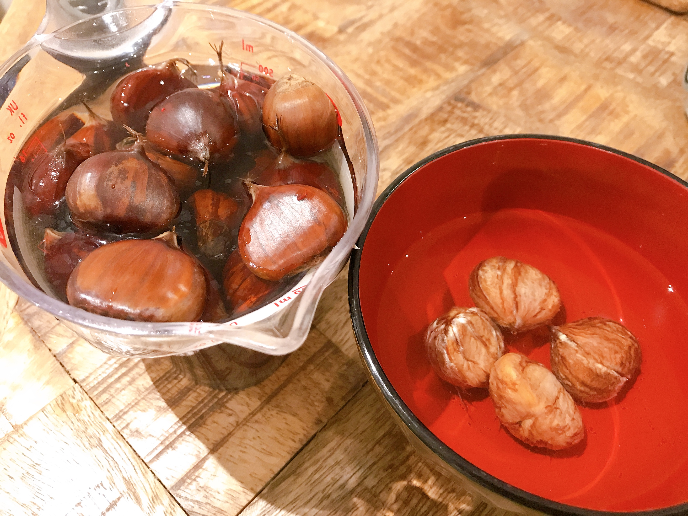
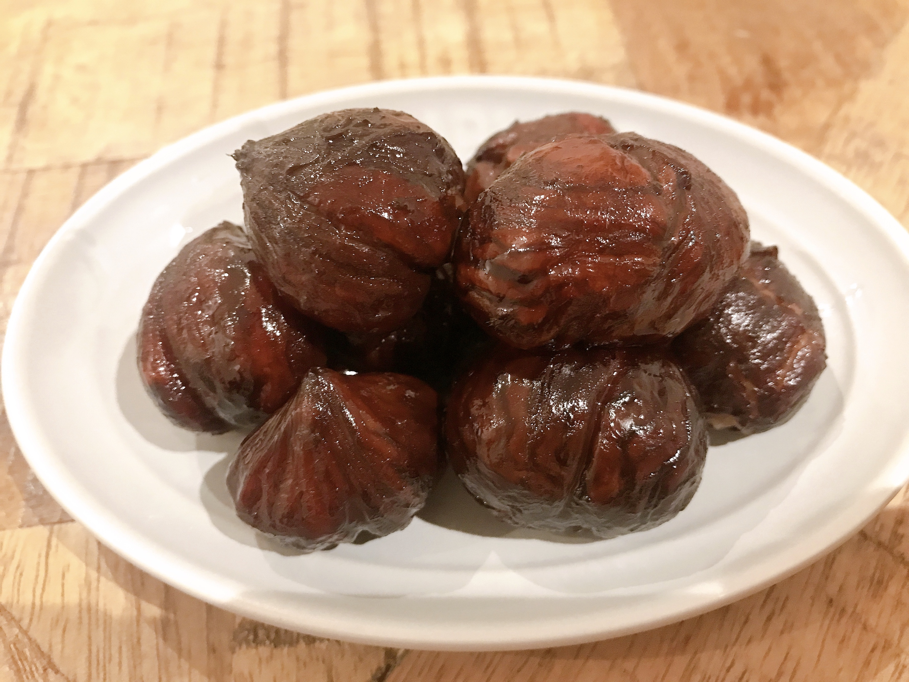

---
title: 【イギリス・ロンドンで栗】渋皮煮
date: 2020-10-17T21:00:00.000Z
description: 秋なので栗を食べてみました。
slug: chest_nuts2
tags: 
  - イギリス生活
  - ロンドン
  - 栗
  - グルメ
keywords: chest_nuts2
---    

前回の焼き栗に納得がいかなかったので、渋皮煮に挑戦してみました。  
私が知っている日本の栗とは大きさ、甘み、身の柔らかさが違ったので、成功するかは謎ですが、日本のレシピを参考に作ることに。  
以下、簡単に作り方です。

まず、鬼皮を剥きます。  
熱湯につけて１晩おき、皮を柔らかくします。  
   
一つ一つ包丁でむいていきます。  
なかなか今季のいる作業ですが、Netflixをみながらのんびりやるのが楽しい。  
頭のところが破れやすいので気をつけて剥きます。  
鬼皮をむくと、渋皮が下にあり、筋のようなものもみえます。この後煮こぼすときにはがしやすくなるので、そのままで、、、 

全部むけたら重曹を入れたお湯で10分ほど煮ます。お湯がアクで真っ黒くなりますが、気にせずに。  
その後、ざるにあげ、爪楊枝で筋を撮ります。この作業が楽しい！！筋が綺麗にとれると本当に気持ちいいです。
全部取れたら、重曹入りのお湯で２〜３回ほど煮ます。かなり崩れやすいのでざるにはあげずにお湯だけ捨てる感じで。その後、２回ほど重曹なしのお湯で煮ます。

重曹が抜けたら、栗の半分ほどの重さの砂糖を入れたお湯で落とし蓋を使いながら煮立てないようにじっくり煮て、お湯が半分から1/3ほどになったらそのまま冷まして完成です。  
   

きれいにできました。崩れてしまったものもあるけど、それはそれで美味しかったです。  

