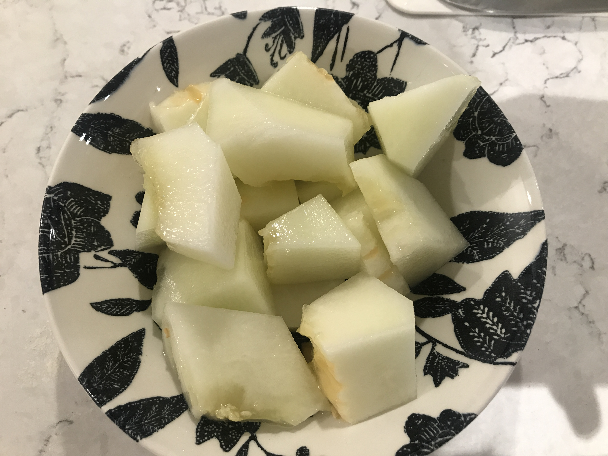

ロンドンに住んでいると日本ではあまりみないフルーツに出会います。
しかも安い！！←これ大切。

小さい桃のようなFlatpeachは5こ100円、すももみたいなnectarineは５個200円、スイカは中くらいで300〜400円くらい、メロンは１玉200円、キウイやオレンジ、イチゴ、ラズベリーもすごく安いです。  

味は全部は食べたことはないですが、どれも甘くて美味しい！  

今回は初めて食べるフルーツ**honeydew**を紹介していきます。　
お値段は£1.5（250円くらい）  

##見た目  

こんな感じで黄色くて楕円形、皮は硬くて、ずっしりとしています。  

切ると中は真っ白！

ここで想像と違くてすこし戸惑いましたが、さらに切ってみることに。  
楕円なのでタネを先に撮るよりはきりながとったほうが簡単でした。  
私の場合はこのまま輪切りにして皮をむいて切り分けました。 

***注意***
メロンのように皮と身の色が別れてないので、皮を薄く剥くと食べにくいです。  
5mmくらいは剥かないと口の中に残ります。  

##味  

全部切り分けたらこんな感じ。
見た目は梨みたいですが、色以外はメロンそのものでした。  
日本で食べるメロンより若干果肉がしっかりしていて、さっぱりしている気がします。  
フルーツをあまり食べない旦那さんも、「美味しい」と言って食べていました。  
暑い日におすすめのフルーツです。