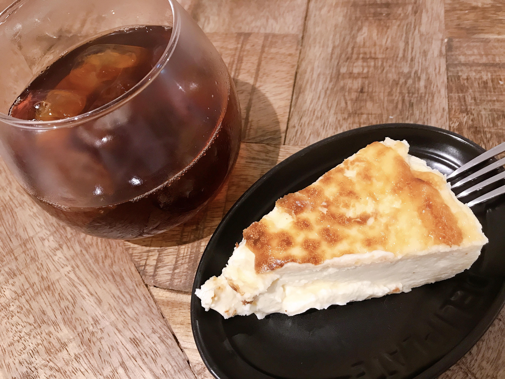
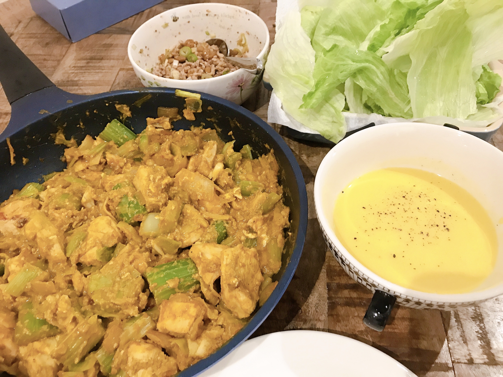
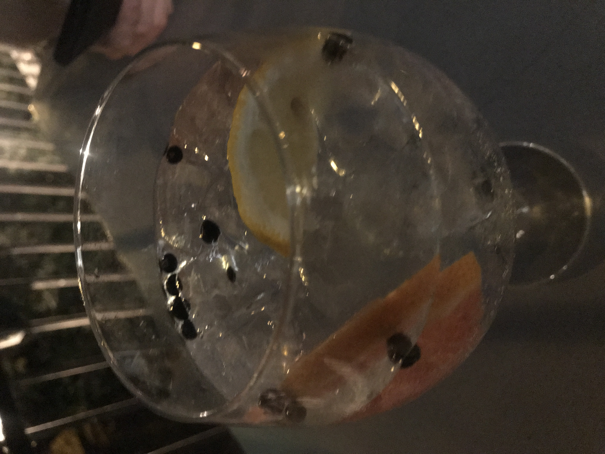

---
title: 【脂肪燃焼スープダイエット】やってみた{7日目}
date: 2020-08-8T23:00:00.000Z
description: 脂肪燃焼スープダイエットをします。１週間の食事、体重変動を記録します。
slug: soup_diet7
tags: 
  - イギリス生活
  - ロンドン
  - ダイエット-
  - 脂肪燃焼スープ
keywords: diet
---  
 

7日目体重　-2.1kg(前日比−0.0kg)    

昨日たくさん食べたのに増えてなくて一安心。
今日は最終日だけど、普段から米を食べないので、食べたくなったら食べることにします。  

朝    
スープ　１杯  （鳥胸肉をほぐして100g入れました）

昼  
スープ　１杯   
バスクチーズケーキ  
サラダ少し     
  
このチーズケーキは旦那さんが前日飲み会でスペイン料理屋さんに行った時に買ってきてくれたもの。ほんとーに美味しかった。  

夜  
スープ　１杯
納豆ひき肉のレタス包み　  
プーパッポンカリー（鶏胸肉）  
冷製豆乳コーンスープ   
    

この日は暑すぎて夜パブに飲みに行ってしまいました。
ジントニック.

  

トニックウォーターは糖質がかなり高いです。  
ハイボールとかにすればよかったと後悔しましたが、飲みたかったので飲み干しました。  
おいしかったー。
