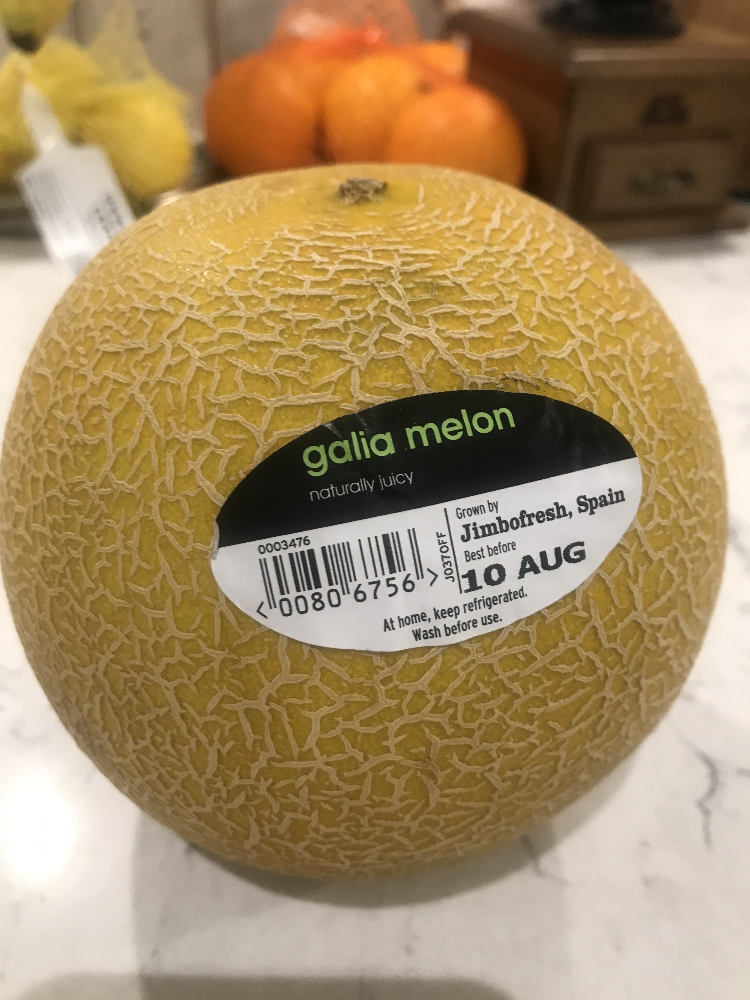
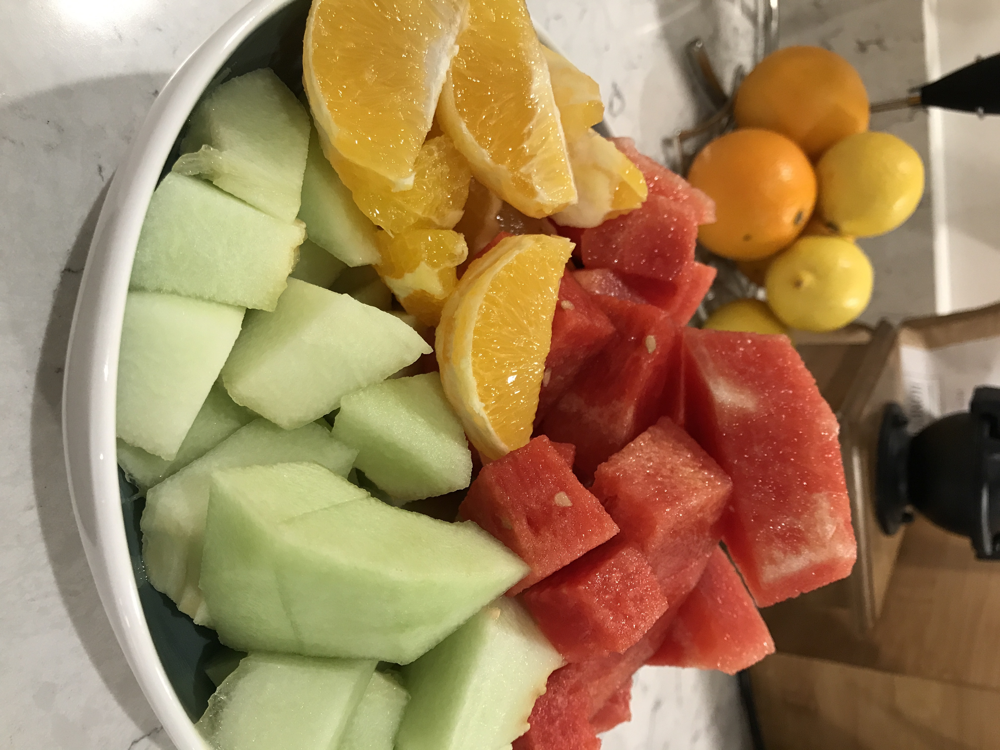

---
title: 【脂肪燃焼スープダイエット】やってみた{3日目}
date: 2020-08-4T23:00:00.000Z
description: 脂肪燃焼スープダイエットをします。１週間の食事、体重変動を記録します。
slug: soup_diet3
tags: 
  - イギリス生活
  - ロンドン
  - ダイエット
  - 脂肪燃焼スープ
keywords: diet
---  

３日目の朝です。  
普通にお腹すいてるけど、辛いほどじゃなかったです。  

３日目体重  -1.8kg(前日比-0.7kg)  

減ったー！まだむくみとかで純粋に脂肪が減ったわけではないだろうけど嬉しい。  
3日目は野菜とフルーツとスープの日。  

フルーツの方が好きなのでフルーツ中心です。  
  
今日はこのメロンとスイカ、オレンジを中心に食べます。  
   

朝    
スープ１杯
小玉スイカ　1/4個
小玉メロン　1/4個  
オレンジ　半分  

昼  
スープ　１杯  
レタス 少し  
プチトマト １個  
小玉スイカ　1/4個
小玉メロン　1/4個  
オレンジ　半分 　

夜  
スープ　１杯  
レタス 少し  
プチトマト ２個  
小玉スイカ　半個  
オレンジ　２個 　  

３日目もフルーツが食べれたので全然辛くなく、幸せでした。  
結構お腹いっぱい食べたから、明日の体重が不安、、、