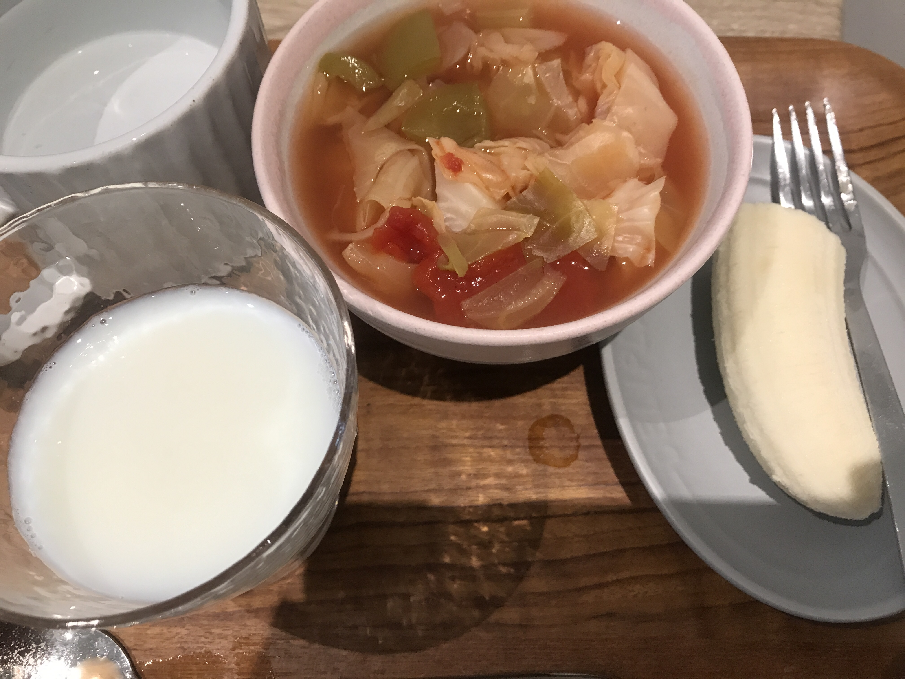
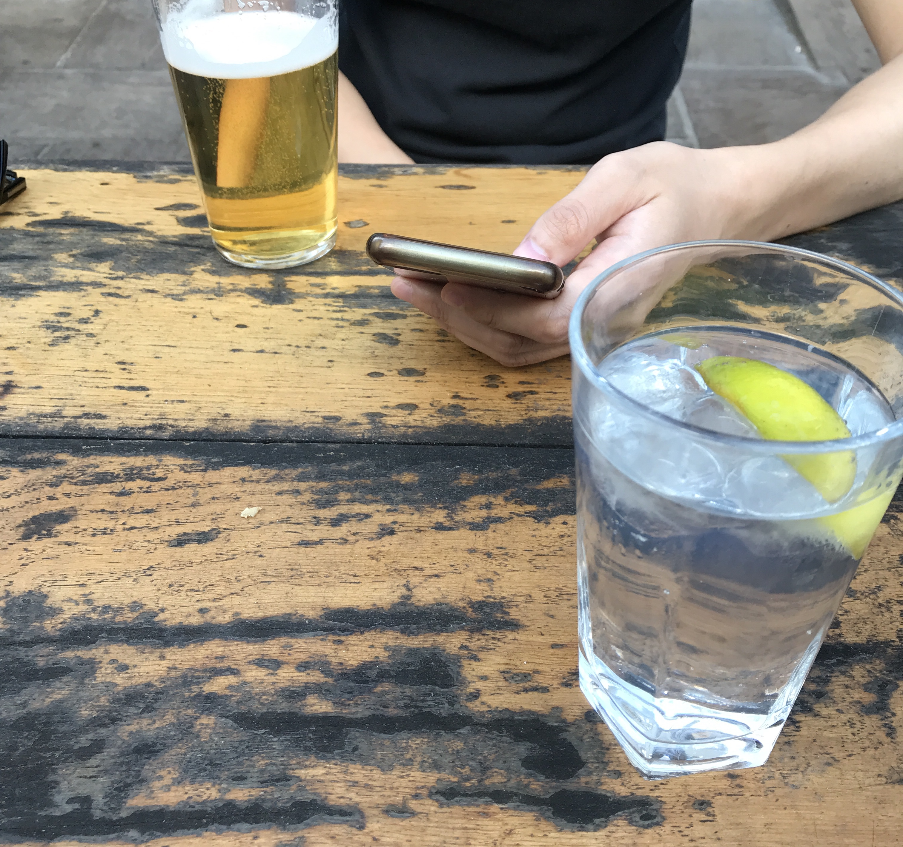

---
title: 【脂肪燃焼スープダイエット】やってみた{4日目}
date: 2020-08-5T23:00:00.000Z
description: 脂肪燃焼スープダイエットをします。１週間の食事、体重変動を記録します。
slug: soup_diet4
tags: 
  - イギリス生活
  - ロンドン
  - ダイエット
  - 脂肪燃焼スープ
keywords: diet
---  

４日目体重　-2.2kg(前日比-0.4kg)    

減ったー！栄養素あまりとっていないから当たり前かもしれないけど、うれしい。  
ダイエットはゆっくりのほうがいいっていうけど、目に見えて減るとやる気出るし、私には合っている気がする。  

4日目はバナナ３本とスキムミルク500mlの日  

朝  
スープ１杯  
バナナ半分（半分悪くなってた...）  
スキムミルク100ml  
  
昼  
スープ１杯  
バナナ１本  
スキムミルク200ml   
野菜の出汁煮物（玉ねぎ、スナップエンドウ、ケール）  
レタス少し、プチトマト２個  

夜  
スープ１杯  
バナナ１本  
スキムミルク200ml    
レタス少し、プチトマト２個  

サラダとバナナで乗り切ったけど、今までの中では一番空腹感があったかも。  
辛いってほどではないけど、ずっとお腹がすいている感じでした。  
後、エネルギーなくて集中力がなくなってるからなのか、コップを割ってしまいました。  
Pubに行ったけど、ビールを飲まなかった自分をほめてあげたい！トニックウォーターを１口飲みました。（残してしまってすいません。）
  
