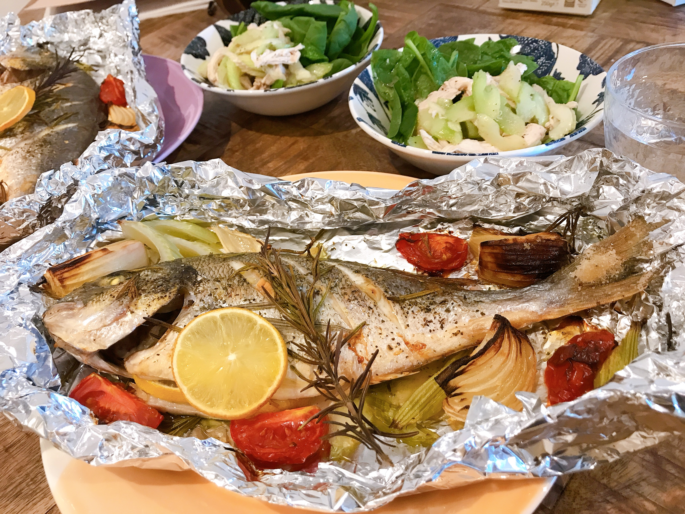

---
title: 【脂肪燃焼スープダイエット】やってみた{5日目}
date: 2020-08-6T23:00:00.000Z
description: 脂肪燃焼スープダイエットをします。１週間の食事、体重変動を記録します。
slug: soup_diet5
tags: 
  - イギリス生活
  - ロンドン
  - ダイエット
  - 脂肪燃焼スープ
keywords: diet
---  

４日目体重　-1.9kg(前日比+0.3kg)      

やっぱり増えてたー。泣  
昨日一気に糖分とったから当たり前といえば当たり前か。  

５日目は肉、魚とトマトの日。  

朝  
スープ　１杯  
(肉を調理する元気がなかった)

昼  
スープ　１杯  (鶏胸肉200g入り)  
レタス少し  
中トマト３個

夜  
スズキのオーブン焼き（中トマト１個、玉ねぎ、セロリ添え）  
中トマト３個  
蒸し鶏とセロリの和物  
サラダほうれん草   

明日が牛肉の日なので鶏肉とお魚でタンパク質をとりました。おいしかったです。  
お腹いっぱいまで食べたので、体重が不安。