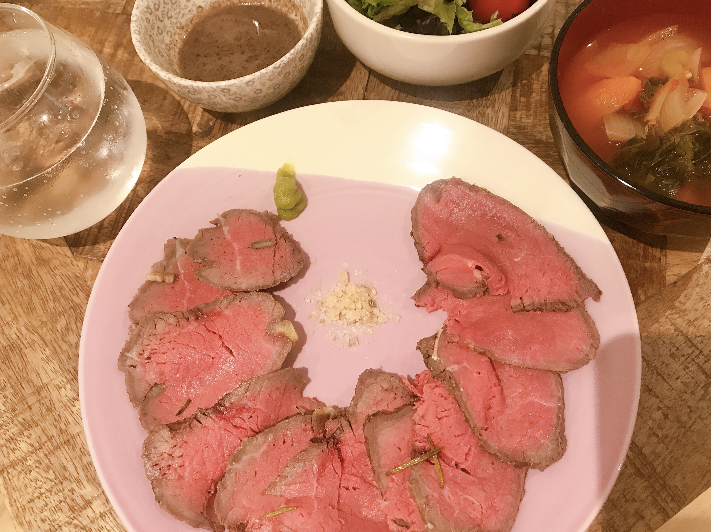

---
title: 【脂肪燃焼スープダイエット】やってみた{6日目}
date: 2020-08-7T23:00:00.000Z
description: 脂肪燃焼スープダイエットをします。１週間の食事、体重変動を記録します。
slug: soup_diet6
tags: 
  - イギリス生活
  - ロンドン
  - ダイエット
  - 脂肪燃焼スープ
keywords: diet
---  

６日目体重　-2.1kg(前日比−0.2kg)      

減ってたー少しだけどやっぱり減るとうれしい。  
そして今日は牛肉の日！うれしいー。  
ローストビーフに使用と思って朝からせっせと作ったけど、出来上がったのが昼過ぎだったので夜だけ牛肉食べました。  

朝  
スープ　１杯  （鳥胸肉をほぐして100g入れました）

昼  
スープ　１杯   
鶏胸肉とキムチを和えたもの
サラダほうれん草少し  

夜  
スープ　１杯
ローストビーフ 400g　  
プチトマト３個  
レタスサラダ    
  

ローストビーフおいしい。  
ロンドンでは熟成肉（21日とか30日）くらいのものならばスーパーに普通に売ってて、キロ£１２とかで買えます。幸せ。ちなみに、脂が多い部位より赤身のほうが高い。
   

