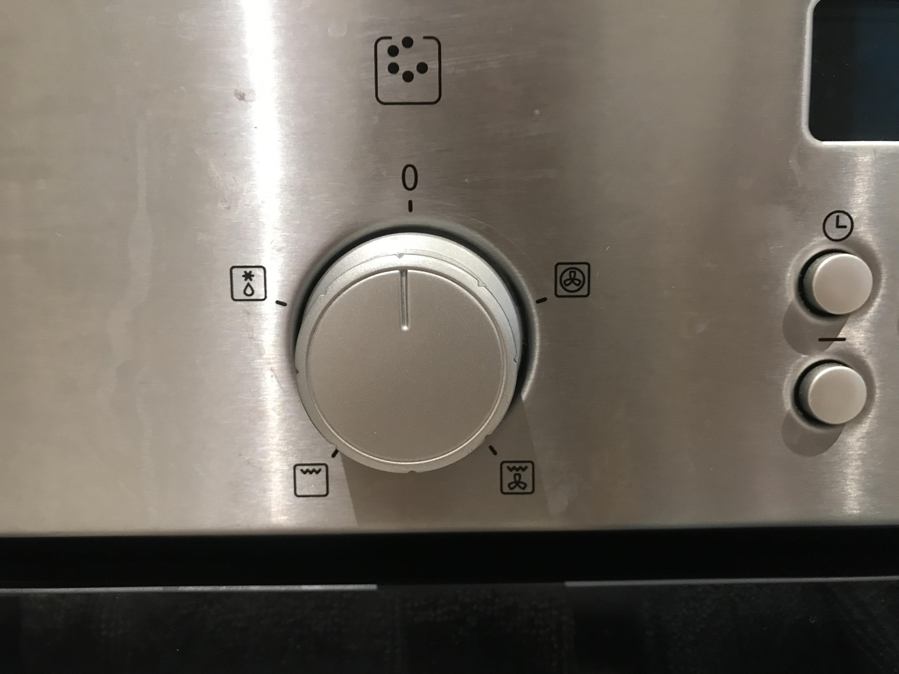

---
title: イギリスのオーブンの使い方
date: 2020-06-24T20:20:00.000Z
description: イギリスの家電、オーブン、使い方、BOSCH、ダイヤル説明
slug: home_appliance_oven
tags:
  - イギリス家電
keywords: ロンドン生活、イギリス生活
---  

イギリスの家はほぼ大きなオーブンがついています。  
初めて使う時に使い方がわからなかったのでまとめます。  
使い始めたら、すごく便利で、使わないともったいないです！！  
  
## 使い始める前に  
庫内を確認します。絶対ではないですが、した方がいいです。  
イギリスの賃貸物件はもちろんクリーニング済みですが、日本のように完璧にきれいになっている訳ではないです。  
オーブンの中が汚れていていざという時に使えないなんてことも。。。  

## オーブンのダイヤルマークの意味  
  

上記のようにマークがあります。時計回りに説明します。  

<!-- **羽をまるで囲んでいるマーク**   -->
### 羽をまるで囲んでいるマーク 
オーブンにファン（送風）がついているもの。庫内の温度のムラが少なく、早くあたたまる。    
複数段使うとき、短時間で外だけしっかり焼く時によいです。（ローストビーフなど）。余熱も早くできます。
自宅には下記にしるした「従来のオーブン」マークがないので、ローストチキン、ローストポーク、パン、クッキー、パイ、オープンオムレツ、野菜のオーブン焼き、プディングなどを作っています。  

### 上がギザギザで羽のマーク  
グリルにファンがついているもの。上側のみの熱源。グリルだけより庫内の温度が高くなりやすく、ムラが少なくなる。  
上側を焼くものなので魚、野菜を焼くことができますが、途中で裏返す必要があります。    
こちらでケバブ、ラムチョップなどを作っています。  

### 上がギザギザのマーク  
グリル機能。  
上側をこんがり焼く機能でトーストなどに使用できます。 
私は、グラタンなど、中も暖まっていて、表面のチースだけ焼き目を付けたい時などに使用しています。 

### 水滴のマーク
グリル解凍機能。  

我が家にはないですがそのほかのマークがついているものもあるようです。  
わかる範囲で説明します。  

### 上下２本の線のマーク  
従来のオーブン。じっくりと温める時に使用する。基本的には１段で使う。    
ケーキやパンはこのモードが適しているみたいです。ローストポーク、
ローストチキンもよいみたい。  

### お皿をよこからみたような線が３本ならんでいるマーク  
お皿をあっためる機能。  
我が家にはないので、お皿はオーブンの温度を50度くらいにして温めています。。。

以上になります。  
他のマークがついているものもあるみたいです。せっかくなのでわたしも今後はもっと使いこなして行きたいです。  
ちなみに私はしばらくグリルをオーブンのようにつかっていました。。
。(なんとかなる)
  
また、同じ温度でも機種によって強かったり弱かったりするみたいなので、少しずつ慣れていくしかないみたいです。