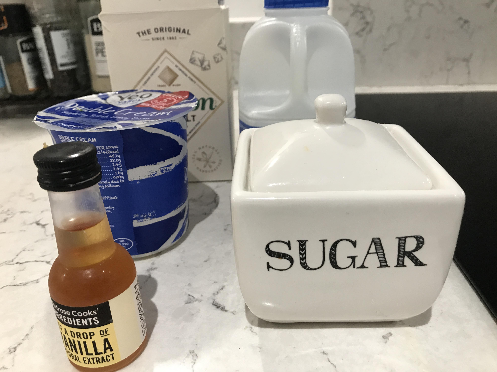
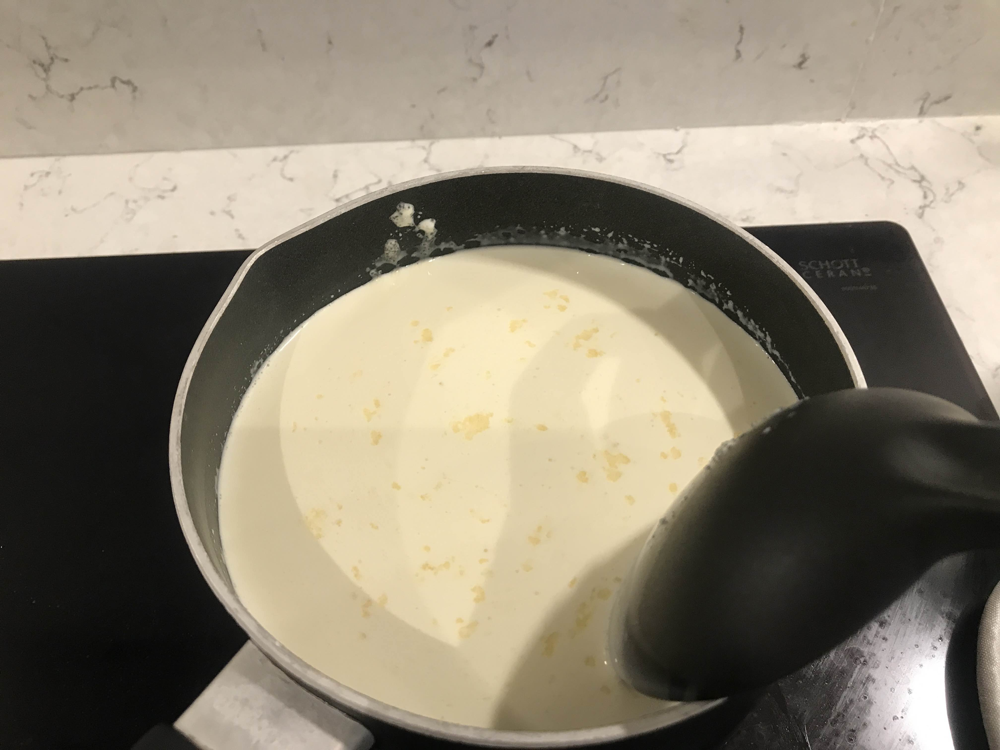

イギリスのスイーツは基本的に甘いです。  
甘いもの大好きな私でも、思わず「甘い！」と言ってしまうほど。  
ハーゲンダッツやベンアンドジェリーズもありますが、日本のものは日本人向けに作られているのか、やはり日本のものより甘く感じる。（きもちの問題？）  

そこで、今回は手作りでアイスを作ることにしました。  
でも、ふと考える。。。イギリスではタマゴを生で食べる習慣がなく、火を通さないスイーツは不安。サルモネラ菌がどーとかこーとか。  
なので、タマゴを使わないジェラートを作りました。  

### 準備するもの  
 
-生クリーム（Double　cream） 227G 
-ミルク（スキムミルクが入ってないやつ）生クリームと同僚
-グラニュー糖  70〜80g  
-塩  2つまみ   
-バニラエッセンス 少し（後入れ）  

 以上で作りました。イギリスは生クリームも牛乳も日本のものと脂肪分が違うので、感覚でしたが、ちょうど良い味になりました。濃厚だけどさっぱり、甘すぎない感じです。　 
 
 ### 作り方 
1.上記のバニラエッセンス意外の材料を鍋に入れて沸騰しないように温めます。  
 

 2.かき混ぜながらゆっくり温めて少しふつふつしてきたら火を止め、バニラエッセンスを加えます。  

 3.荒熱が取れたら、ボウルかバットに入れ冷凍庫で冷やします。  
 4.１〜２時間ごとに取り出してブレンダーやミキサーで混ぜます。これを２〜３回繰り返します。  
    

　5.固まったら出来上がり!!  

とても簡単で材料もシンプル、甘さもちょうど良いジャラートができました。日持ちもするので、毎日少しずつ食べてます。  
きなこやあんこをトッピングしたら、ラム＋レーズンでラムレーズンにしてもおいしかったです。  
  
イギリスのスイーツにも少しづつ挑戦したい！