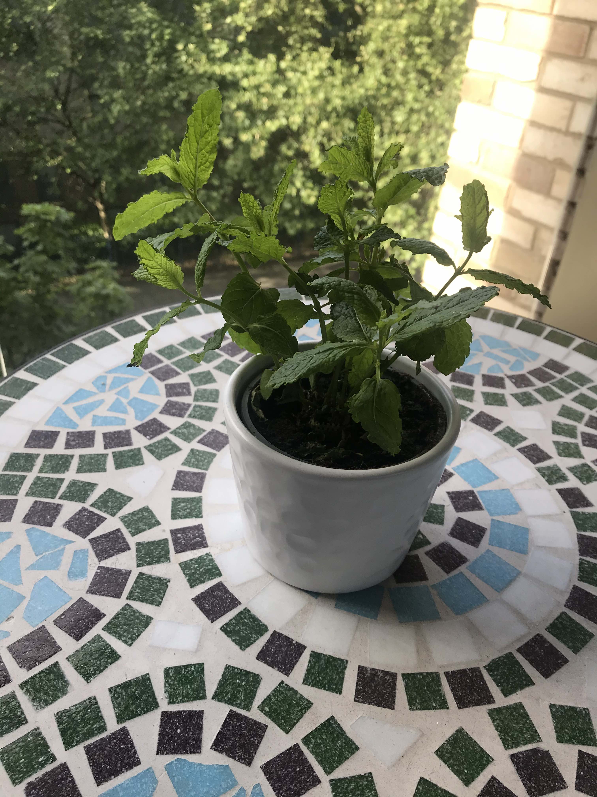
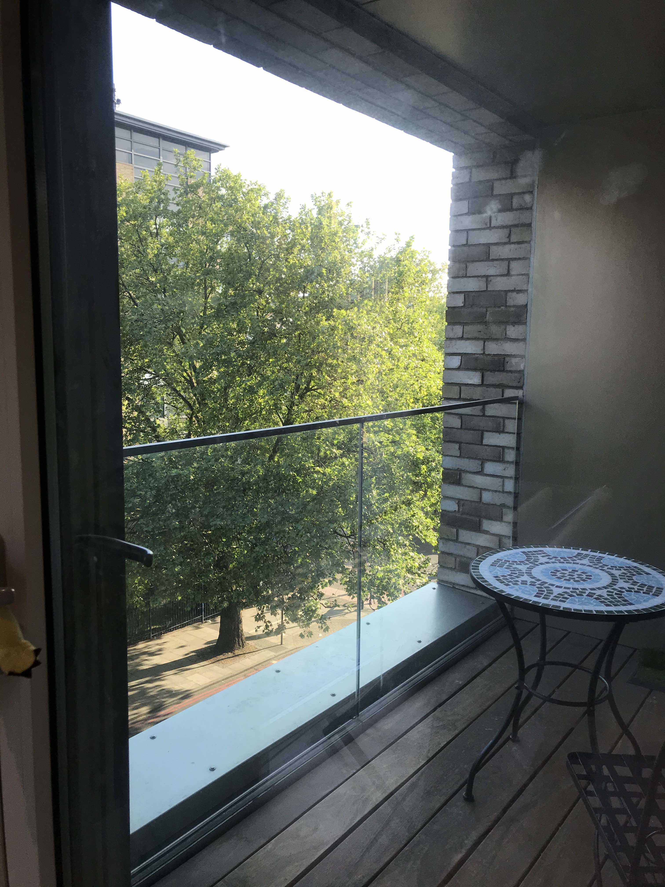
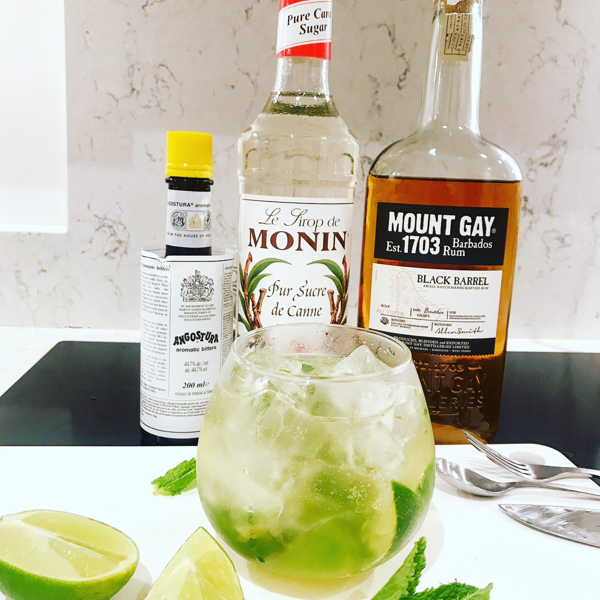
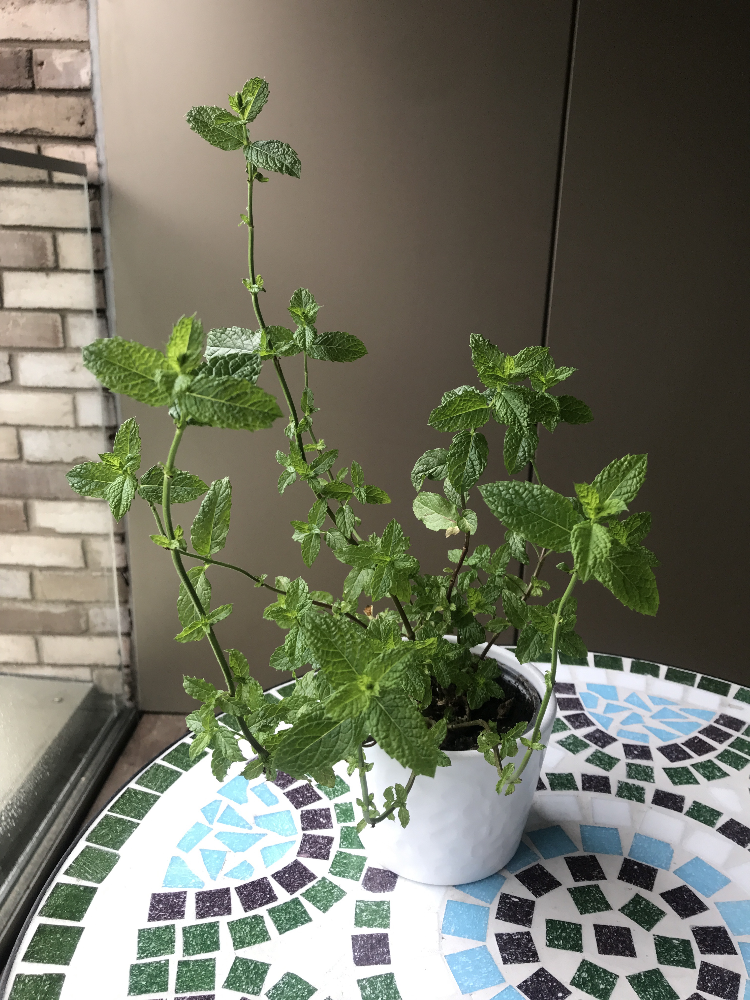

### イギリスのハーブ事情  
イギリスにはどこでもハーブがたくさん売ってます。  
袋詰のものも売っていますが、鉢ごと売られているスーパーも多いです。  
ハーブって、買っても余ってしまって使いきれないことが多いので、我が家ではよく使うものはベランダで育てています。  
ちなみにお値段は  
袋詰め→£１くらい    
鉢→£1.5くらい  
と少しずつ使うなら断然鉢の方がお得という印象です。  
でも、いっぺんに大量に使う時は袋詰めのほうを買ったほうがいいと思います。  
我が家では週末はミントをいれたお酒を飲むことが多いので、ミントを購入しました。  

###  育ててみた  
実は昨年もパクチーとスペアミントの育成に挑戦した我が家。  
でも、私が５日間旅行に行った際、帰宅した時には残念なことに。。。  
今年は幸か不幸か外出制限があるので、面倒は毎日みれます。  
今年こそ枯らさないことを誓い購入しました。  
購入時はこんな感じです。  
  

植え替えした方がいいのだろうけれど、安くハーブを定期的に得る目的なので、余計なコストはかけずに育てます。  
## 育て方  
-風通しの良い、日光の当たる場所に置く。  
去年、風通しを考えずに、ベランダの床（我が家は左右壁、前ガラス張りのベランダ）においたら風通しが悪かったらしく、葉っぱに白い斑点ができました。
  
この画像の左下あたりにおいた。
うどん粉病というらしい。ガーデニングが趣味の母親に聞くと、風通しが悪かったのではないかとのことだったので、今年はテーブルの上で育てることに。
-毎日土が湿る程度の水やりと気がついた時に悪くなった（色が薄かったり、茶色っぽくなってる）葉っぱをとる。  
水はあげすぎでもよくないみたいです。感覚であげています.
葉の間引きは、少し元気がなくなる葉っぱをとります。  
  
以上です。ほんとに何もしてない。 肥料もなし。（ホントはもっと手をかけるともっと早く育つかもしれませんが、この育て方でも使いきれないくらい育ちます）
でも、ミントは何もしなくても育ちます。１週間くらいで上の写真の倍くらいのボリュームになります。（写真撮るの忘れました）  

### ミントを使う  
我が家は週末お酒を飲むことが多いので、主にお酒に入れます。  
この週はモヒートを作って飲みました。  
  
こんな感じで何倍か飲むとミントもほぼ裸になります。  　

でも裸にってから１週間でこんな感じに復活します。  
  

使ったところから新しい葉っぱがどんどん出てきます。  
こんな適当な育て方でも一夏楽しめるので、よかったらやってみてください。