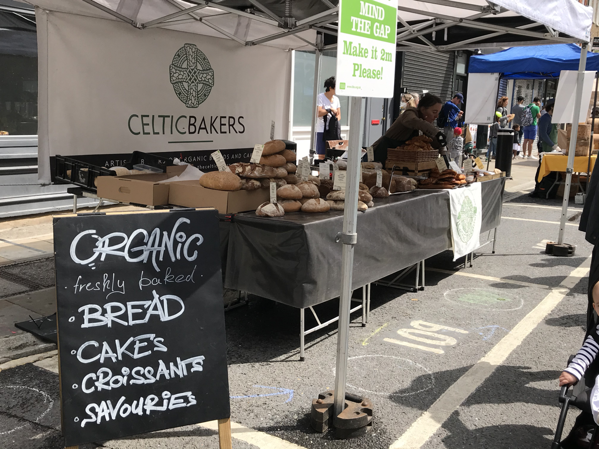
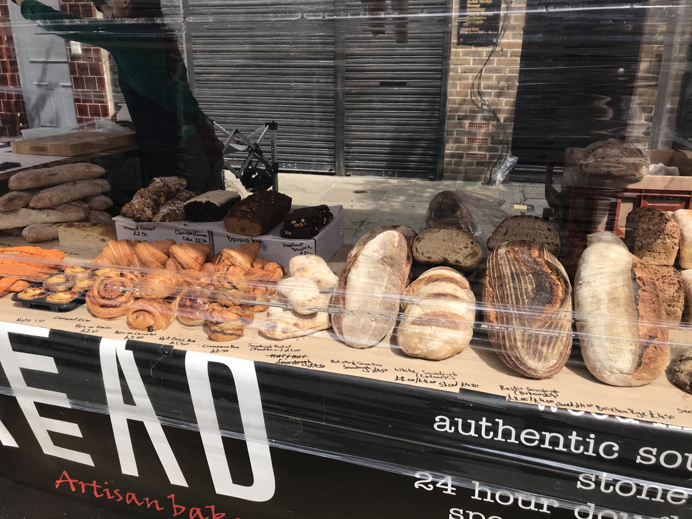
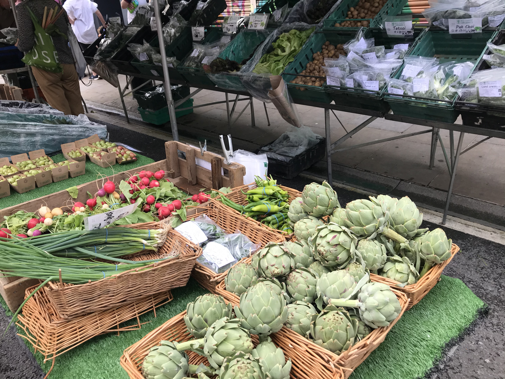
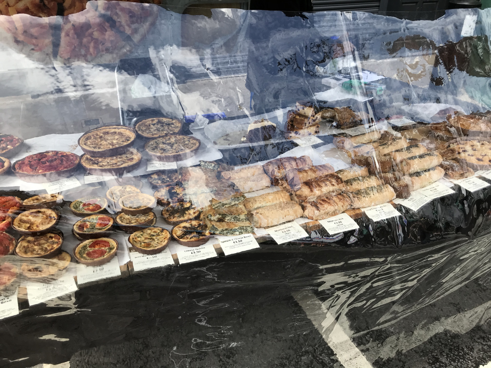

今日はロンドンのマーケットに行ってきました。  

観光ブックにも載っているロンドン観光のひとつのマーケット！！ 

バラマーケットやポートベローマーケットなど有名なものもたくさんありますよね。  

マーケットによってやっている曜日や主に扱う商品が曜日で分かれているものもあります。  
（例えば：月・骨董　火・食品　など）

有名なマーケットは観光客の方が多いですが、その分賑わっていて、様々な商品があり、行くだけでも楽しいです。  

特にバラマーケットはチーズやオイルなど安くはないですが、美味しいものが揃っていて行くだけでワクワクします。  

今回私が行ったのは地元の人が行くマーケット。  
主に野菜、肉、鮮魚、チーズ、パン、ケーキ、キッシュ、タルト、オイルなどのオーガニック商品を扱う店が多いです。  

## 商品紹介

### パン  

小さなマーケットなのですが、パン屋さんはたくさんあります。  
主にバケットなどのハード系のパンとクロワッサンなどのパイ系？のパンを売っています。  
シードが入っていたり、ブラウンのものもあって悩む。。。普段パンを食べないのですが、マーケットに来ると買ってしまいます。  
  
*コロナ対策*もしっかりされています。  

### 野菜屋さん
  

野菜屋さんもたくさんあります。  
季節のものやオーガニックがたくさんあって、スーパーより安いものも多いです。  
タマゴなんかも良さそうなもの（買ったことないので違いがわからない）があります。  
ちなみにイギリスのタマゴは日本と違い`常温保存`。  
というのも、少し前までは生食はできないと言われていました。最近検査をクリアしてものは生食できるとなっていますが、それも黄身のみで白身は火を通した方がいいとのこと。  
タマゴ事情はまた別の記事で書こうと思います。。。  

### 肉屋、鮮魚屋さん  
 
肉、鮮魚もオーガニック系が揃っています.  
お値段はすこし高めかな。  

でも、スーパーにはないイカもあってテンション上がった！！  
ただ、お値段が。。。イカ１杯で大体£６〜８くらい。日本円で900円から1200円くらいするとゆー。いくら物価が高いとはいえ、特別な時にしか買わないと決めています。。。  

### ラップサンド、タルト、生パスタ屋さん    
   

すぐに食べれる軽食も売っています.  

私の中でこうゆうお店は気をつけている！つもり。  
なぜかというとあたり、はずれがすごいから。  

日本では外食やテイクアウトでまずいな、と思うことはなかった私ですら、イギリスの食事は食べられないこともあるほど。   

見た目はおいしそうでも、**要注意**です。  
でも、もちろん美味しいものもあるし、何事もチャレンジということで数点購入しました
あとで紹介、感想を書こうと思います。

