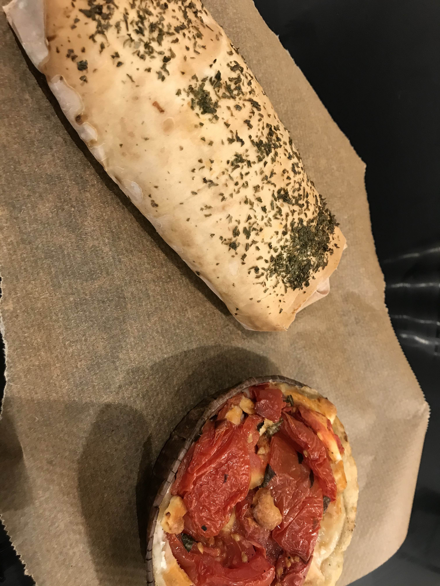
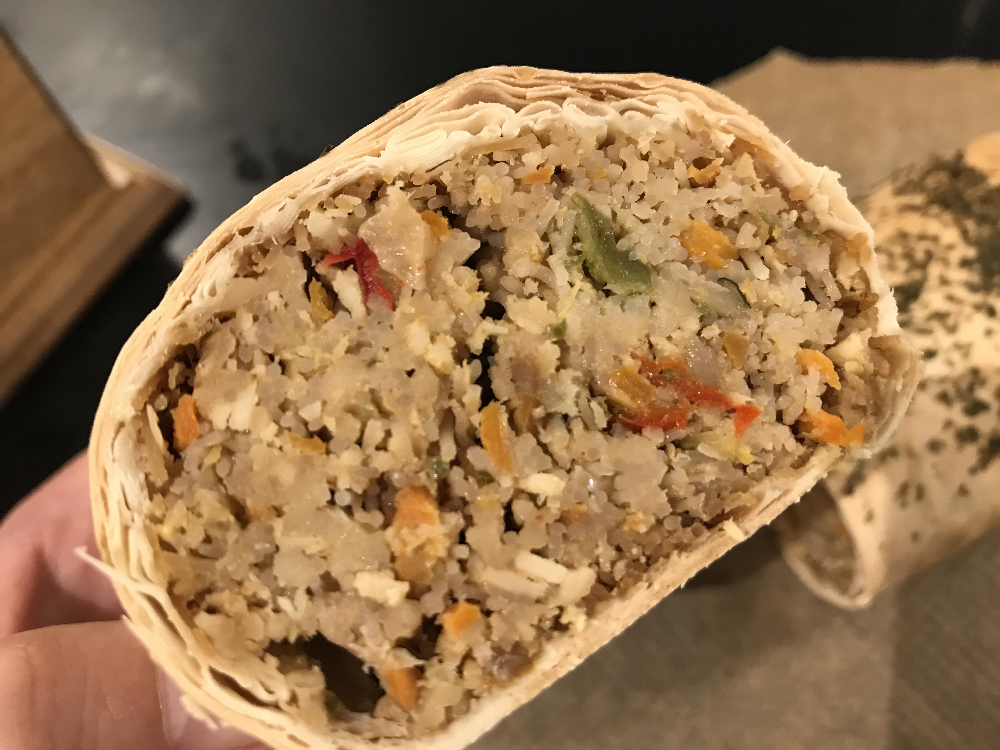

いよいよマーケットで購入したものを実食です。  
まずはランチにタルトとグリーンカレーラップサンドをいただきました。  
  
  
ラップサンドの中はこんな感じです。  
    

ひき肉と春雨が入っていてすこしグリーンカレーの味がするかな？といったかんじ。  
正直にいいますと、ラップサンドはあまり口には合わす、食べきれませんでした。  

タルトはトマトがジューシーで美味しかった！！   

ともかく、小さいマーケットでもいろいろな出会いがあって楽しいので、是非行ってみてください。  

ほかにもまだまだ買ったのでのちほど紹介します。