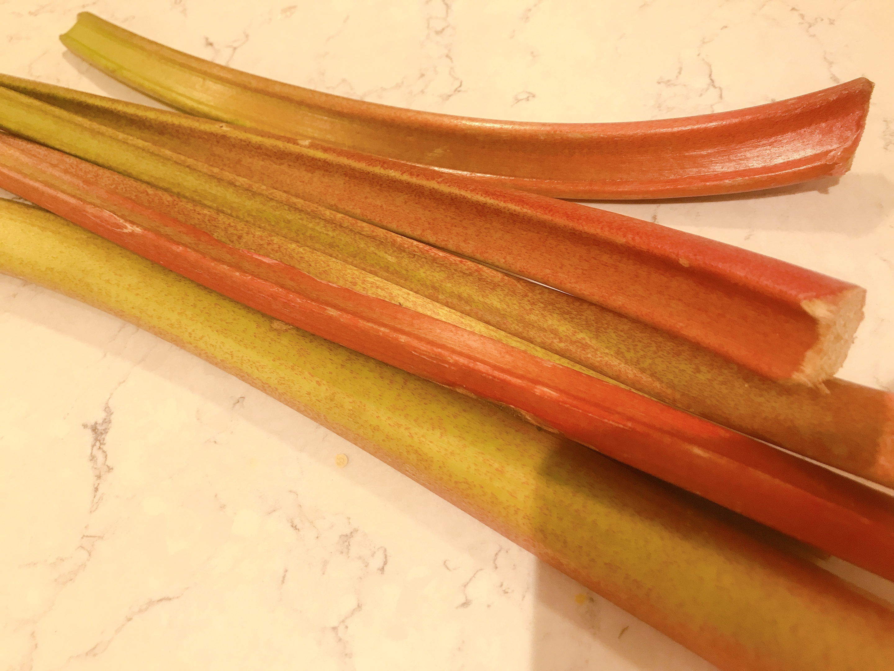
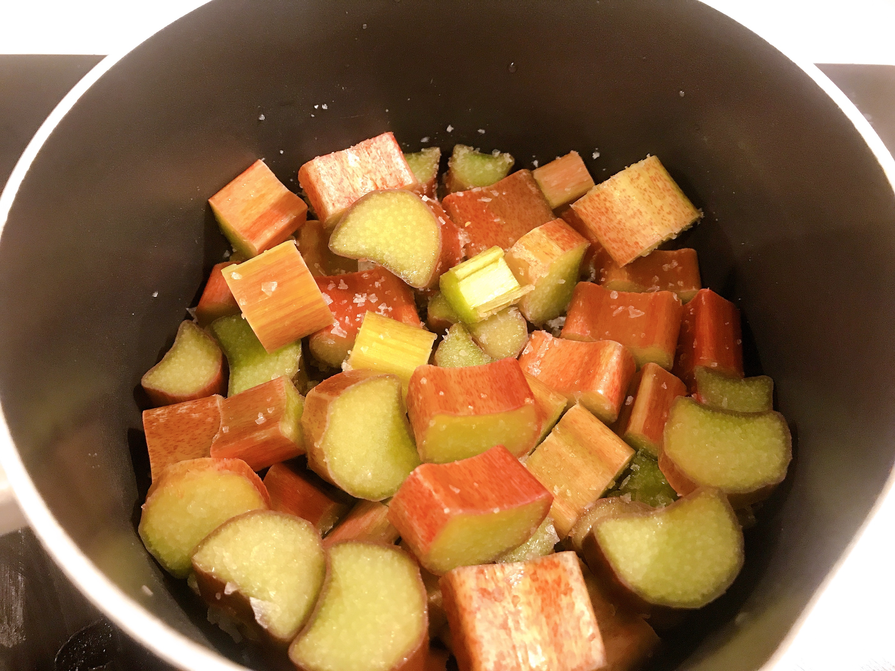
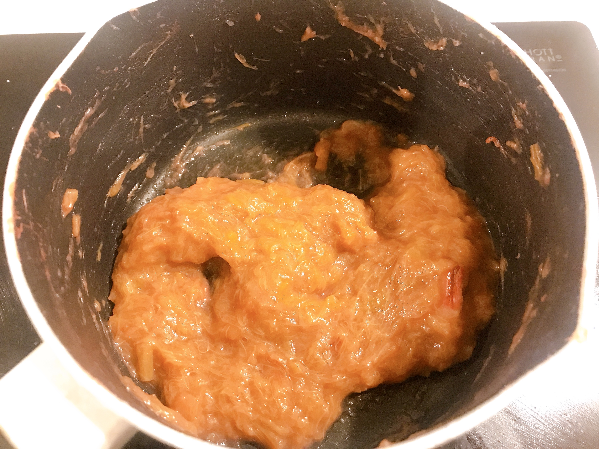
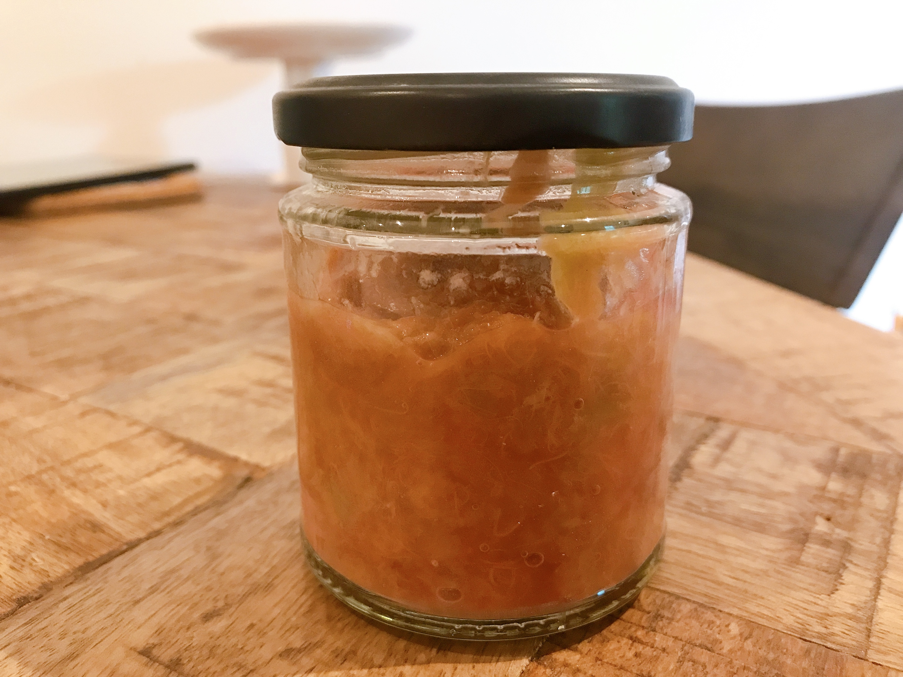

欧米ではポピュラーな野菜、ルバーブ。こちらではジャムやクランブルケーキに使われることが多いみたいですが、塩で煮るとなんちゃって練り梅を作れると聞き、作ってみました。  

## ルバーブとは  
大きなふきのような野菜で、イギリスでは春から夏にかけて出回ります。  
茎は緑色のものと赤色のものがあります。種類が違うみたいですが、練り梅の時は赤色のものを選ぶと良いです。色だけで味はそんなにかわらないみたいです。
味はかなり酸っぱく、ジャムにすると爽やかな酸味で美味しいみたいです。  
ビタミンや食物繊維も豊富です。  
　  
** 注意 **   
葉っぱにはシュウ酸が含まれていて有毒なので、もしついていたら破棄してください。  

## はちみつ練り梅の作り方  
### 材料  
（170mlの瓶に８割の量になります）  
- ルバーブ　200g  
- 塩　小さじ２  
- 蜂蜜  小さじ１〜  
こちらが今回購入したものです。  
    

### 作り方  
1. ルバーブを１cmほどのぶつ切りにして、塩をかけて５分ほど置いておきます。   
    

2. 弱火にかけて煮ていきます。だんだん柔らかくなり、繊維がほぐれてきます。  
味をみながらお好みで蜂蜜を加えて、練り梅の硬さまで煮詰めたら完成です。  
   

3. 煮沸消毒した瓶にいれて保存します。  
  
   
  
*point*  
塩だけだとかなり酸っぱいので、味をみながら調節してください。  
冷めるとすこし色は濃くなります。  
灰汁をとるために水につける方法もあるみたいですが、酸味も抜けるとのことなので私は行いませんでした。味も特に気にならなかったです。  
保存は塩分、保存状況にもよりますが１ヶ月ほどです。冷凍保存もできます。  

### 感想  
酸味強めの練り梅のような味でとても美味しいです。  
イギリスで梅干しは手に入りますが、高いので思いっきり使えない、、、  
でも、これがあれば心置きなく料理に使えます。  
ルバーブ自体も冷凍しておけるみたいなので、なくなったらまた作ろうと思います。
