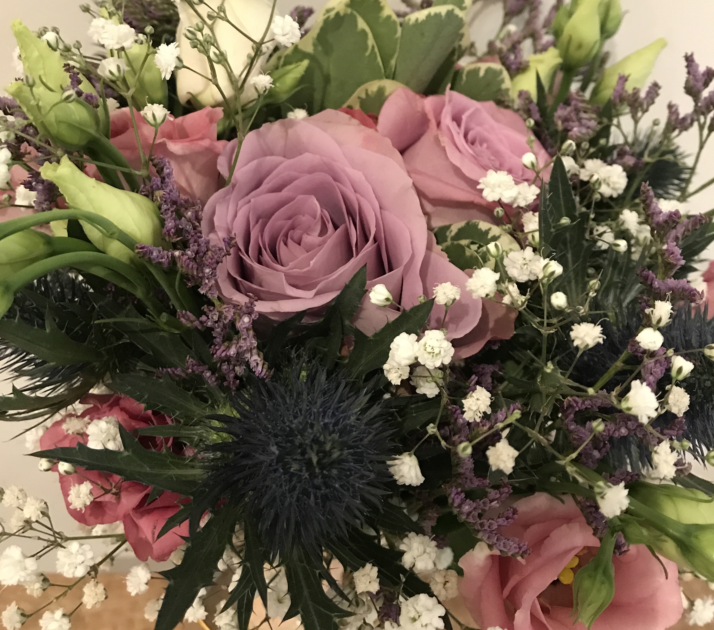
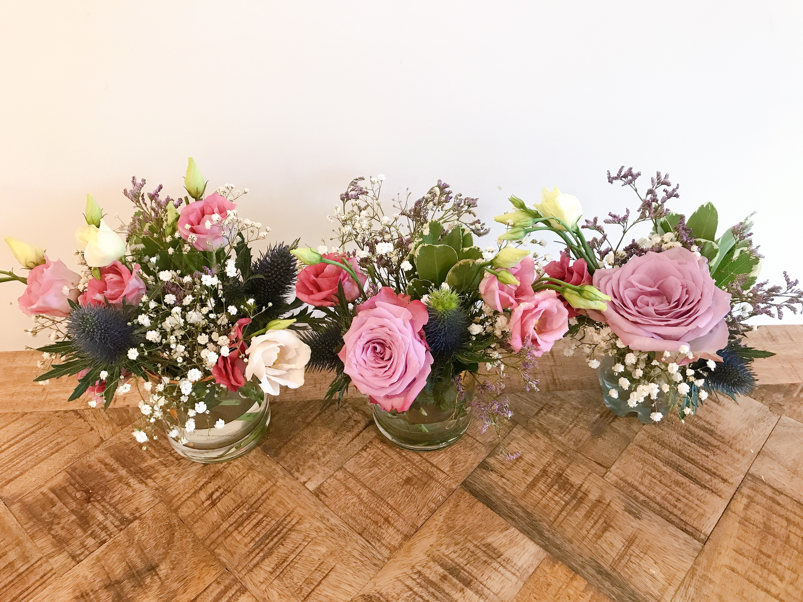

---
title: ロンドンでウェディングフォト
date: 2020-08-22T23:00:00.000Z
description: ロンドンでウェディングフォトを比較的お安く撮りました。値段と方法、注意点をまとめます。
slug: london_wedding_photo
tags: 
  - イギリス生活
  - ロンドン
  - ウェディング 
  - 写真
keywords: wedding
---   

すっと撮りたいと思っていた、ロンドンでのウェディングフォト。今回思い切って撮ったら思ったより手軽に撮れるので、お勧めの方法、注意点をまとめます。在住の方でなくても、ロンドン旅行のついでに撮りたい方なども参考になると思います。家族写真や思い出写真にも使えます。  

**費用**  

ヘアセット　£70＋チップ£10  (新婦のみ、リハーサルなし。交通費、早朝料金込み)
メイク　自分でやりました  
ドレス、インナー、靴　結婚式の際に購入したものを使いました  
ブーケ　£45
写真　£370  （３時間、２・３箇所）  
クリーニング　これから（おそらく£200〜250）  

詳細  
**ヘアセット**  
Mixbという、ロンドン在住日本人のサイトで見つけた方に行ってもらいました。こちらの方だと日本人と可愛いの感性が違うのと、美容師の国家資格がイギリスにはないらしく、初めてだと技術的にもわからないので日本人の方にお願いしました。   
結果、すごくよかった！！  
よかった点は以下です。  
・前日にキャンセル可能（ロンドンは天候が変わりやすいため前日に判断して決行するか決めます）  
・早朝でも可能、店舗に行かなくてもいい。  
・自分のWebページを持っている方がほとんどで、経歴や、自分のしたセットを載せているので好きなタイプを選びやすい。  
・家でやってくれるので、楽
・ドレスを着る時に簡単なお手伝いならやってくれる  
注意点  
・私は記念撮影の気持ちだったので気にならなかったですが、心配ならリハーサルを別日にお願いした方がいいです   
  
**ブーケ**  
ここでちょっとしたトラブルがおきました。  
上記にも書いたように記念撮影の気持ちだったため、近所の花屋さんに前日にお願いしにいきました。すると、ウェディングブーケは１週間前の注文で前日ではつくれないと...でも、軽いフォトシュートでこだわらないから、普通のブーケみたいな感じでいいから、と言って交渉しました。それでも、無理っぽいと言われたので、私が花を選んで、それをまとめてくれ、と言って花を自分で選ぶことに。途中で、店員さんにどんな花が合うかな、と言ったら、今までに見たことない花のセレクトだからわからない、と言われました。泣  
でも、私的にはすごく可愛い組み合わせになったのでそれをまとめて欲しいとお願いしたら、しっかり柄の部分にリボンを巻いてくれ、パールのピンで止めてウエディングブーケのようにしてくれました。  
本当なら１週間以上前に注文してイメージ写真などをつけると、それに近い感じで用意し、当日の朝に届けてくれるとのこと。でも、私的には天気も変わる可能性あるし、安いものでもないので、悩むかも、と思いました。利用する方は、悪天候の場合のキャンセル方法などをチェックして利用してください。（多分値段もだいぶ安くしてくれました。事前に頼むともう少し高くなりそうです）  
  
色が暗く写ってしまったので、撮影後に生けた写真を載せておきます。 

**写真**  
こちらもMixbで頼みました。フォトグラファーの方も複数人の方から値段と作品を見て事前に細かい対応をメールで聞いて決定しました。  
わたしは経験豊富で作品の雰囲気が好きな方を選ばせていただきました。ロケーションフォトなので、場所などもいくつか提案していただいてその中から選びました。  
フォトも前日に決行かキャンセルかの判断とういことでした。  
よかった点  
・前日にキャンセル可能（天候で判断）
・写真撮影ができる箇所を熟知している。（ハイドパークなどの大きな公園は私有地となるため、写真撮影で利用するにはお金がかかるみたいです。勝手に撮っていたら注意されることもあるとか。ほかにも撮っていいところとダメなところがあるみたい。）  
・自然な感じで撮ってくれる（被写体が緊張していたので、出来上がりはわからない笑）  
・色調補正など全てやってくれ、データの枚数制限なく送ってくれる。  
注意点  
私たちは結婚式と結婚式前に２回フォトシュートをやっていますが、大きな違いは、ポーズを自分たちでとること！！日本では目線や手の角度、ブーケの位置までこまかく指示され、そのままで撮りましたが、今回は「楽しい感じで」「適当にいい感じでポーズ変えていってください」と言う感じ。私たちには少しハードルが高く、同じようなポーズになりがちでしたが、カメラマンさんが面白く、表情は自然と笑っていたと思います。  
カメラマンさんに上記の話をしたら、「それじゃあ、どのカップルも同じような感じになっちゃいますね。」と。たしかにカップルのカラーが出るのは今回のスタイルかな、と思いました。  
なので、ロンドンで撮られる方は、事前にいろいろな写真をみてポーズの研究をするといいかも。  

**クリーニング**
クリーニング店はドレス専門店があるので現在探し中です。  
今回着たドレスはjenny packem のhermia なのですが、細かいビーズがたくさんついているので慎重に選び中です。イギリスのクリーニング店をどこまで信用していいものか笑  

以上が今回のフォトシュートで経験、学んだことです。これから撮影する方の参考になれば幸いです。